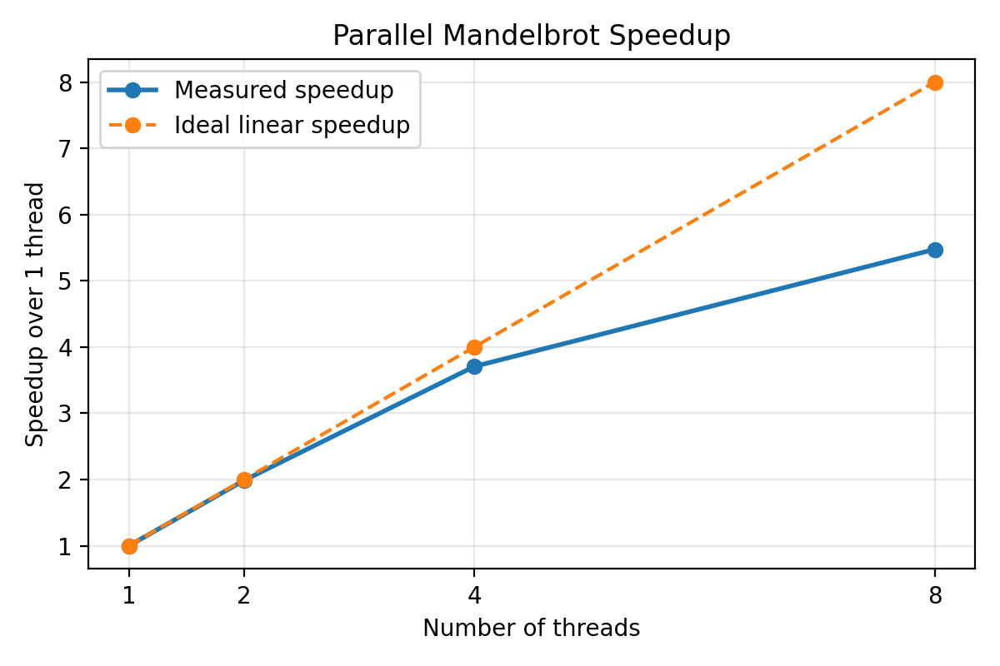

# Parallel Mandelbrot Generator Report

* Name: Zixuan Xia
## 1. Overview

This project implements a Java application that computes and displays the Mandelbrot set in parallel. The application was designed around the main grading criteria from the project description:

1. Correctness of the parallel implementation
2. Speed and scalability
3. Code quality and abstractions
4. Features and interface quality

The final program is a desktop GUI application with a `main()` entry point, configurable thread count, interactive navigation, multiple colour palettes, smooth colouring, and true 5-point antialiasing.

## 2. Development Approach

I first implemented the GUI and the basic Mandelbrot escape-time algorithm, then refactored the rendering code so that the computational core is separate from the Swing interface.

The rendering pipeline is organized as follows:

- `MandelbrotExplorer` manages the current view, user settings, and render scheduling.
- `MandelbrotPanel` displays the current image and handles mouse and keyboard interaction.
- `MandelbrotRenderer` contains the numerical Mandelbrot computation.
- `MandelbrotTask` renders one horizontal strip of the image.
- `BenchmarkRunner` runs repeatable headless performance experiments from the command line.

This structure keeps the GUI logic separate from the parallel computation logic and makes benchmarking easier.

## 3. Parallelization Strategy

The image is split into small horizontal row blocks. A fixed number of worker tasks are submitted to a `ThreadPoolExecutor`, and each worker repeatedly claims the next available block through an `AtomicInteger`.

This dynamic scheduling improves load balancing. Different regions of the Mandelbrot set do not all require the same number of iterations, so some blocks are more expensive than others. By dynamically claiming the next block instead of giving each thread one fixed region, idle workers can continue with the remaining work immediately.

Each task writes only to its own rows in the image buffer, so no fine-grained locking is needed. This avoids race conditions on the pixel array and keeps the parallel code efficient.

To make repeated recomputation correct, the program also uses a render generation counter. Whenever the user zooms, pans, resizes the window, or changes settings, a new generation is created and old tasks are cancelled. This prevents stale computations from overwriting newer results and ensures that timing information corresponds to the latest render only.

## 4. Performance Improvements

Several optimizations were applied to improve speed:

- The pixel iteration uses primitive `double` arithmetic instead of allocating `Complex` objects for every pixel.
- Rendering writes directly into the backing `int[]` of a `BufferedImage`.
- Work is split into many small strips to improve load balancing across threads.
- The default thread count is based on the number of available processors.
- A dedicated benchmark mode was added so that performance can be measured consistently without GUI interaction overhead.

In addition, the `A` command now enables real 5-point antialiasing instead of only changing Swing interpolation hints. This improves visual quality while keeping the feature optional, since it is naturally more expensive.

## 5. Features and Usage

The application supports the following interactions:

- Left-click drag: zoom into a selected rectangle
- `Shift + Left-click drag`: pan the view
- Mouse wheel: zoom in or out around the cursor
- `Escape`: reset the view
- `I` / `O`: zoom in / out
- `T` / `Shift + T`: increase / decrease the number of threads
- `C` / `Shift + C`: increase / decrease the maximum number of iterations
- `P` / `Shift + P`: cycle through colour palettes
- `A`: toggle 5-point antialiasing
- `S`: toggle smooth colouring
- `Ctrl + S`: save the current image as a PNG file

The status overlay at the bottom of the window displays the current thread count, iteration count, active palette, smooth-colouring state, antialiasing state, and the last render time.

## 6. Performance Evaluation

The benchmark was executed using the built-in command-line mode:

```bash
java -jar target/MiniProject-1.0-SNAPSHOT.jar --benchmark --threads 1,2,4,8 --iterations 1200 --width 1600 --height 1200 --runs 5 --warmup 1
```

Benchmark settings:

- Image size: `1600 x 1200`
- Iterations: `1200`
- Smooth colouring: `ON`
- Antialiasing: `OFF`
- Warmup runs: `1`
- Measured runs: `5`

Test machine:

- Chip: `Apple M3`
- Cores: `8 (4 performance + 4 efficiency)`
- Memory: `16 GB`
- OS: `macOS 14.5`
- Java: `OpenJDK 23.0.2`

Measured results:

| Threads | Average time (ms) | Speedup |
|---------|-------------------|---------|
| 1       | 1484.77           | 1.00x   |
| 2       | 747.58            | 1.99x   |
| 4       | 400.63            | 3.71x   |
| 8       | 271.24            | 5.47x   |

The project requirement asks for at least a `2x` speedup with 4 cores compared to 1 core, ideally around `3x`. On this machine, the program reaches approximately `3.71x` with 4 threads, which exceeds the requirement comfortably.

The corresponding speedup plot can be generated with the provided script and included in the report:



## 7. Sources

- Mandelbrot set overview: <https://en.wikipedia.org/wiki/Mandelbrot_set>
- Archived tutorial and sample ideas: <https://web.archive.org/web/20230929031131/http://java.rubikscube.info/>

These resources were used for background understanding of the fractal and common GUI controls. The final code was implemented and refactored specifically for this project.
